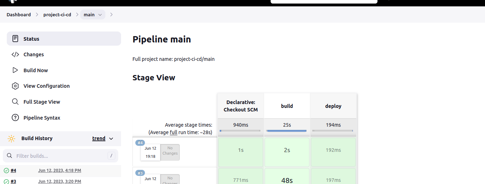
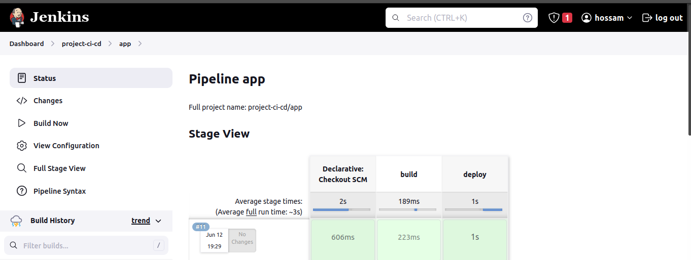
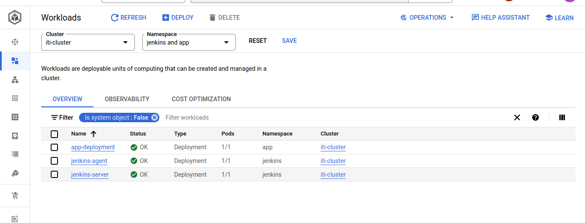
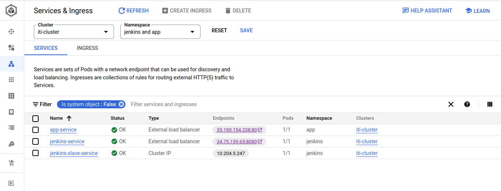
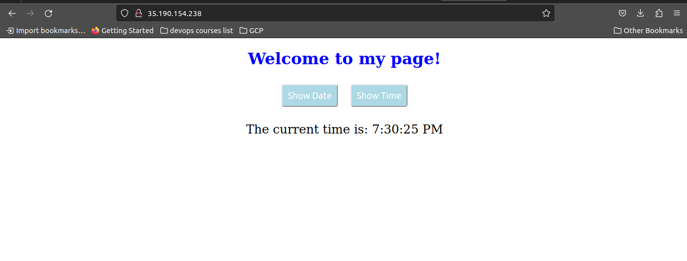

# Final-Project-CI-CD-ITI-IAC
This repository contains Terraform configuration for setting up infrastructure on Google Cloud Platform (GCP) using Infrastructure as Code (IaC) principles, Installing Jenkins  and build Multibranch pipeline to build and deploy an application on GKE 

</br>

---

</br>

## Requirements

-   git
-   Terraform
-   Docker
-   Google Cloud SDK
-   Access to a GCP project with the necessary permissions to create and manage resources.
-   A bucket for the terraform state.
-   A bucket for jenkins deployment

</br>

---

</br>


</br>

---

</br>

## How To Use

1. clone this repo :
   ```bash
    git clone https://github.com/hossamShawky/Final-Project-CI-CD-ITI-IAC/
   ```

2. Change Directory To : terraform-files
   ```bash
   cd terraform-files
   ```

3. Customize Values in "values.auto.tvars" as your project details

4. Run terraform commands:
    ```bash
    terraform init
    ```
    
    ```bash
    terraform apply
    ```

</br>

---

</br>

### Private VM "setup cluster deployments"

1. SSH From Browser

2. Update Packages & Install Kubectl

  ```bash
     sudo apt-get update -y
     sudo apt-get install apt-transport-https -y
     curl -s https://packages.cloud.google.com/apt/doc/apt-key.gpg | sudo apt-key add -
     echo "deb https://apt.kubernetes.io/ kubernetes-xenial main" | sudo tee /etc/apt/sources.list.d/kubernetes.list
     sudo apt-get update -y
     sudo apt-get install kubectl
     kubectl version --client
  ```

3. Google Auth Login
  ```bash
     echo "deb [signed-by=/usr/share/keyrings/cloud.google.gpg] https://packages.cloud.google.com/apt cloud-sdk main" | sudo tee /etc/apt/sources.list.d/google-cloud-sdk.list
    curl https://packages.cloud.google.com/apt/doc/apt-key.gpg | sudo apt-key --keyring /usr/share/keyrings/cloud.google.gpg add -
    sudo apt-get update -y
    sudo apt-get install google-cloud-sdk  -y
    gcloud auth login
  ```        
  "Follow Steps To Auth Login"

4. Install gcloud  
  ```bash
    sudo apt-get install google-cloud-sdk-gke-gcloud-auth-plugin -y
  ```
5.  RUN Command " Download Jenkins-deployment files from gcp bucket"

   ```bash
      sudo gsutil cp gs://cicd-bucket-hossam/* ./deployments/
   ```
   "deployments dir created using meta-data during creatin vm"
6. Connect to cluster (Replace Zone and prject with your customization)
  ```bash
       gcloud container clusters get-credentials iti-cluster --zone us-east1-b --project  iti-gcp-hossam
  ```

7. Apply deployments files "Cpoyied to private-vm From Local PC in meta-data"
  ```bash
       kubectl apply -f deployments
  ```
    This command will create jenkins&app namespaces,jenkins-deployment,jenkins-service,jenkins-service-account,jenkins-volume,slave-deployment and slave-service.

<br>

---

<br>

### Jenkins Configrations
1. open jenkins loadbalancer Endpoint
   ```bash
      kubectl get services -n jenkins
   ```

2. Exec your running container and get first password
    ```bash
       kubectl exec -it <running-container-name> -n jenkins -- bash
       cat /var/jenkins_home/secrets/initialAdminPassword
    ```

3. open Jenkins & create users and passwords.

4. Configure github,dockerHub,kubeconfig and slave (node: "jenkins,123456") credentials.     

5. Create Multibransh Pipline from Git repo: https://github.com/hossamShawky/Final-Project-CI-CD-ITI-Simple-App.git/.

6. Create new node with name "iti-node" and credentials usernameandpassword.

7. Choose a branch and click build now.

<br>

---

<br>

### Steps & Outputs Screenshots
 
 
 
 
 
 
 
