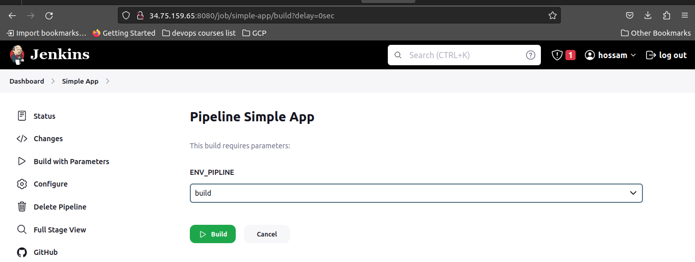
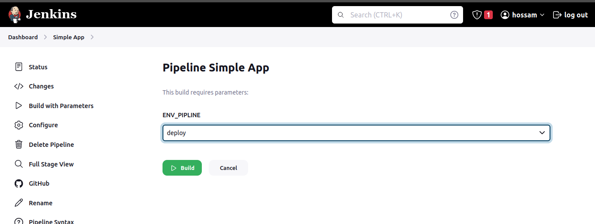
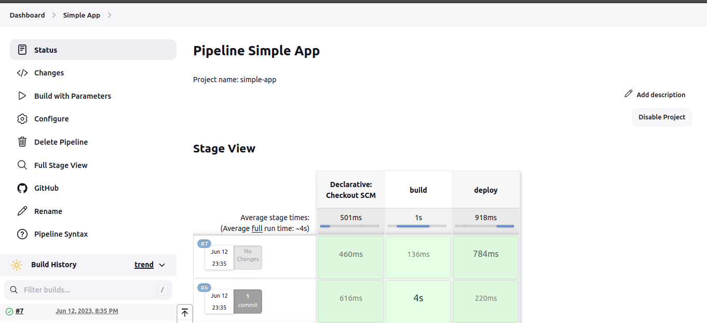
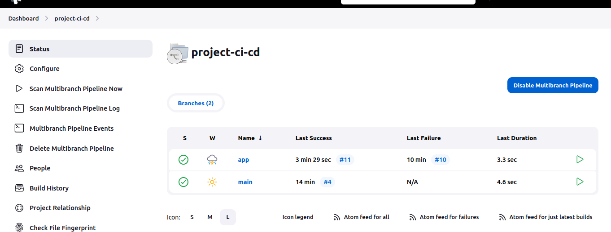
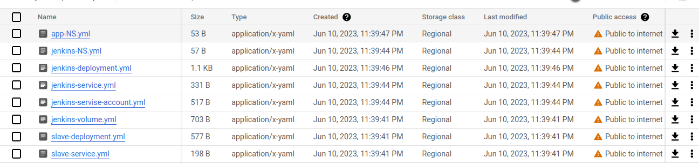

# Final-Project-CI-CD-ITI-IAC
This repository contains Terraform configuration for setting up infrastructure on Google Cloud Platform (GCP) using Infrastructure as Code (IaC) principles, Installing Jenkins  and build Single/Multi-branch pipeline to build and deploy an application on GKE 

</br>

---

</br>

## Requirements

-   git
-   Terraform
-   Docker
-   Google Cloud SDK
-   Access to a GCP project with the necessary permissions to create and manage resources.
-   A bucket for the terraform state.
-   A bucket for jenkins deployment

</br>

---

</br>

 

## How To Use

1. clone this repo :
   ```bash
    git clone https://github.com/hossamShawky/Final-Project-CI-CD-ITI-IAC/
   ```

2. Change Directory To : terraform-files
   ```bash
   cd terraform-files
   ```

3. Customize Values in "values.auto.tvars" as your project details

4. Run terraform commands:
    ```bash
    terraform init
    ```
    
    ```bash
    terraform apply
    ```

</br>

---

</br>

### Private VM "setup cluster deployments"

1. SSH From Browser

2. Update Packages & Install Kubectl

  ```bash
     sudo apt-get update -y
     sudo apt-get install apt-transport-https -y
     curl -s https://packages.cloud.google.com/apt/doc/apt-key.gpg | sudo apt-key add -
     echo "deb https://apt.kubernetes.io/ kubernetes-xenial main" | sudo tee /etc/apt/sources.list.d/kubernetes.list
     sudo apt-get update -y
     sudo apt-get install kubectl
     kubectl version --client
  ```

3. Google Auth Login
  ```bash
     echo "deb [signed-by=/usr/share/keyrings/cloud.google.gpg] https://packages.cloud.google.com/apt cloud-sdk main" | sudo tee /etc/apt/sources.list.d/google-cloud-sdk.list
    curl https://packages.cloud.google.com/apt/doc/apt-key.gpg | sudo apt-key --keyring /usr/share/keyrings/cloud.google.gpg add -
    sudo apt-get update -y
    sudo apt-get install google-cloud-sdk  -y
    gcloud auth login
  ```        
  "Follow Steps To Auth Login"

4. Install gcloud  
  ```bash
    sudo apt-get install google-cloud-sdk-gke-gcloud-auth-plugin -y
  ```
5.  RUN Command " Download Jenkins-deployment files from gcp bucket"

   ```bash
      sudo gsutil cp gs://cicd-bucket-hossam/* ./deployments/
   ```
   "deployments dir created using meta-data during creatin vm"

6. Connect to cluster (Replace Zone and prject with your customization)
  ```bash
      gcloud container clusters get-credentials iti-cluster --zone us-east1-b --project  iti-gcp-hossam
  ```

7. Apply deployments files "Cpoyied to private-vm From Local PC in meta-data"
  ```bash
       kubectl apply -f deployments
  ```
   " This command will create jenkins&app namespaces,jenkins-deployment,jenkins-service,jenkins-service-account,jenkins-volume,slave-deployment and slave-service."


<br>

---

<br>

### Slave Configrations


<br>

---

<br>

### Jenkins Configrations
1. open Jenkins & create users and passwords.
    ```bash
       kubectl get service -n jenkins | grep jenkins-service
   ```
   "Copy External-ip with specific port and access it from browser"


2. Exec your running container and get first password
    ```bash
       kubectl exec -it <running-container-name> -n jenkins -- bash
       cat /var/jenkins_home/secrets/initialAdminPassword
    ```


3. Configure github,dockerHub,kubeconfig and slave (node: "jenkins,123456") credentials.     

4. Create Single/Multibransh Pipline from Git repo: https://github.com/hossamShawky/Final-Project-CI-CD-ITI-Simple-App.git/.

5. Create new node with name "iti-node" and credentials usernameandpassword.

 ⚠️ If node is offline connect slave and Run
  ```bash
  service ssh start
  chmod 777 /var/run/docker.sock
  ```

     

6. Choose a branch and click build now.

7. InCase you run single pipline: after choosing Git credentails type
  - branch: main 
  - JenkinsFile: Jenkinesfile_pipline
  - build: select Build With Parameters

8. To get app url Run:
  ```bash
     kubectl get service -n app | grep app-service
   ```
   "Copy External-ip with specific port and access it from browser"

<br>

---

<br>

  
  ⚠️ To Destroy All Resources Run [Type 'yes' to confirm]
  ```
  terraform destroy
  ```
  

### Outputs Screenshots "Single Pipline"
 
 
 
 
 
 
 

<br>

---

<br>


### Outputs Screenshots "MultiBranch Pipline"
 
 
 
 
 
 

 <br>

---

<br>

 


### Customization
Feel free to customize the project as per your requirements. You can modify the VPC CIDR ranges, security groups, instance types, or add additional configurations as needed.

### Contributions
Contributions to enhance or expand this project are welcome! If you find any issues or have suggestions, please open an issue or submit a pull request.

### License
This project is licensed under the MIT License.